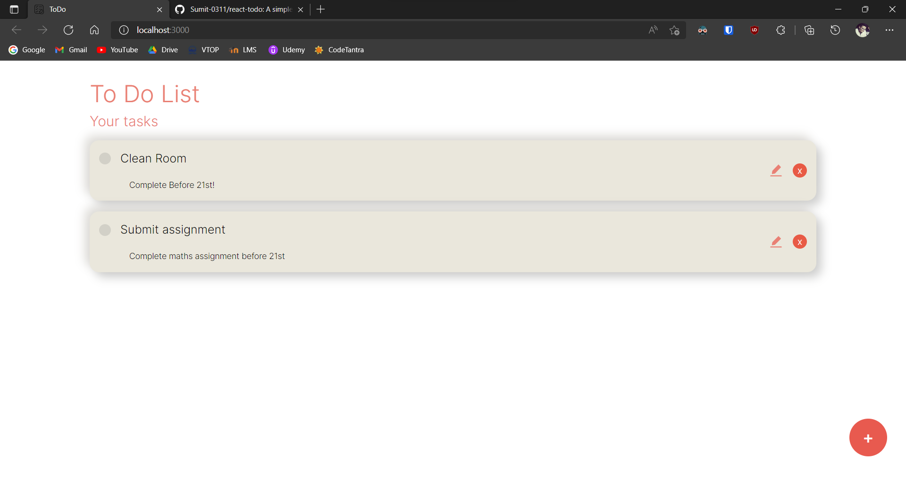
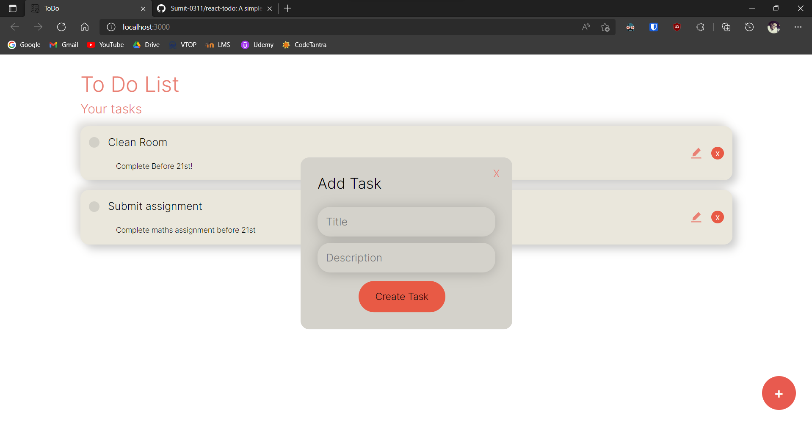
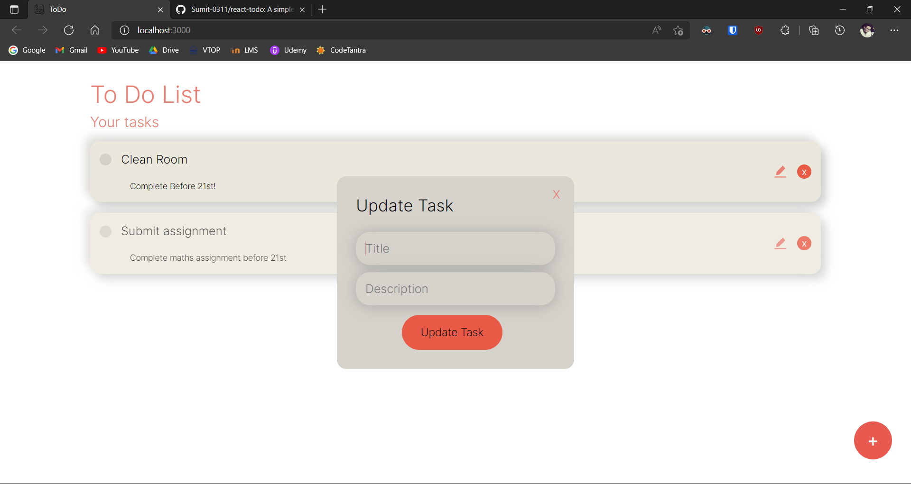

<h1>React ToDo List </h1>
<p> This is a simple todo list app created using the MERN Stack with basic CRUD operations. Users can easily add, delete and update their tasks.</p>

<h3> Get Started! </h3>

<p> Clone this repository to you local machine using the command below:</p>

```
git clone https://github.com/Sumit-0311/react-todo.git
```

<p>Once cloned, use cd to change into the directory and then cd again into the api folder.

```
cd api
```

<p>. Then hit the command below to install all of the dependencies. </p>

```
npm install
```

<p> Then go back to the root directory and cd into the client folder

```
cd client
```

<p>. Then hit the command below to install all of the dependencies. </p>

```
npm install
```

<p>Then, to start the application use this command on both the server and the client in two separate terminals and the app will open in a separate window </p>

```
npm start
```

<h2>Screenshots</h2>



